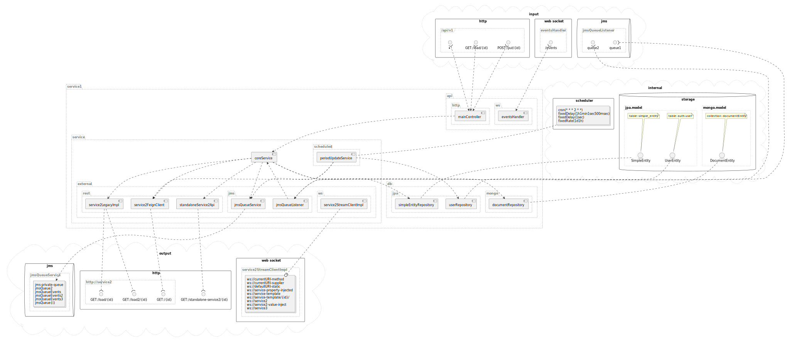

# Spring Boot components visualizer (under construction)

A tool to visualize external and internal connections of a Sprint Boot
application.

By default, generates a PlantUML schema with Spring components,
relations and interfaces like mvc controllers, websocket services, jms
and so on.

Inspired by Spring REST Docs.

Requires Java 11 or higher.

## Schema example

[puml](./test/service1/src/schema/components.puml),
[svg](./test/service1/src/schema/components.svg)

<figure>

</figure>

## Supported interfaces

- Beans with dependency relations

- Sprint Mvc controllers

- Spring Data repositories

- WebSocketHandler

- WebSocketClient

- @JmsListener

- JmsTemplate based clients

- @FeignClient

- Standalone Feign client

- RestTemplate based clients

## Planned to support

- @Scheduled

- TaskScheduler

- @KafkaListener

- KafkaTemplate

- GRPC

- Minio

- Spring Webflux (controllers, routers)

## How to use

### Gradle (Kotlin syntax)

Copy the code below to your `build.gradle.kts`

``` kotlin
repositories {
    mavenCentral()
}

dependencies {
    testImplementation("github.m4gshm:spring-connections-visualizer:0.0.1-beta1")
    testImplementation("org.apache.commons:commons-lang3:3.14.0")
}

tasks.test {
    useJUnitPlatform()
    environment("PLANTUML_OUT", "$projectDir/src/schema")
}
```

Next, adds test like below

``` java
package service1;

import com.plantuml.api.cheerpj.v1.Svg;
import io.github.m4gshm.components.visualizer.ComponentsExtractor;
import io.github.m4gshm.components.visualizer.PlantUmlTextFactory;
import org.junit.jupiter.api.Test;
import org.springframework.beans.factory.annotation.Autowired;
import org.springframework.boot.autoconfigure.EnableAutoConfiguration;
import org.springframework.boot.test.context.SpringBootTest;

import java.io.File;
import java.io.FileOutputStream;
import java.io.IOException;
import java.io.OutputStreamWriter;

import static java.nio.charset.StandardCharsets.UTF_8;
import static java.util.Objects.requireNonNull;

@SpringBootTest(classes = {YourSprintBootApplication.class})
@EnableAutoConfiguration
public class SchemaGeneratorTest {

    @Autowired
    ComponentsExtractor extractor;
    @Autowired
    PlantUmlTextFactory schemaFactory;

    static void writeSwgFile(File svgOutFile, String content) {
        var svg = Svg.convert(null, content);
        try (var writer = new FileOutputStream(svgOutFile)) {
            writer.write(svg.toString().getBytes(UTF_8));
            writer.flush();
        } catch (IOException e) {
            throw new RuntimeException(e);
        }
    }

    static void writeTextFile(File file, String content) {
        var parentFile = file.getParentFile();
        if (!parentFile.exists()) {
            parentFile.mkdirs();
        }
        try (var writer = new OutputStreamWriter(new FileOutputStream(file))) {
            writer.write(content);
            writer.flush();

        } catch (IOException e) {
            throw new RuntimeException(e);
        }
    }

    static File getSvgFile(File plantUmlFile) {
        var plantUmlOutFileName = plantUmlFile.getName();
        var extensionDelim = plantUmlOutFileName.lastIndexOf(".");
        return new File(
                plantUmlFile.getParentFile(),
                (extensionDelim != -1 ? plantUmlOutFileName.substring(0, extensionDelim) : plantUmlOutFileName) + ".svg"
        );
    }

    @Test
    public void generatePlantUml() {
        var schema = schemaFactory.create(extractor.getComponents());
        var envName = "PLANTUML_OUT";
        var plantUmlOutFile = new File(requireNonNull(System.getenv(envName), envName), "components.puml");
        writeTextFile(plantUmlOutFile, schema);
        writeSwgFile(getSvgFile(plantUmlOutFile), schema);
    }
}
```

Runs gradle build `gradle test`

Generated files will be located in the `$projectDir/src/schema/`
directory.
