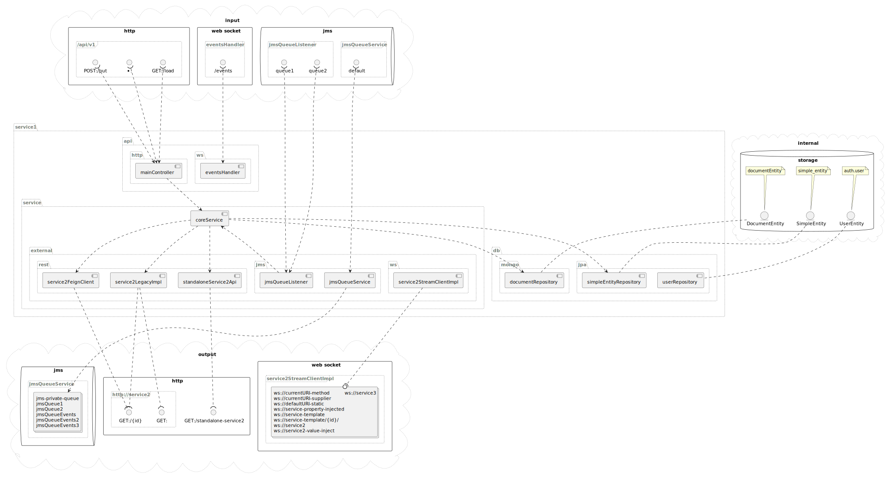

= Spring Boot components visualizer

== Spring Boot components visualizer (under construction)

A tool to visualize external and internal connections of a Sprint Boot application.

By default, generates a PlantUML schema with Spring components, relations and interfaces like mvc controllers, websocket services, jms and so on

Inspired by Spring REST Docs.

Requires Java 11 or higher.

=== How to use
==== Gradle (Kotlin  syntax)
Copy the code below to your `build.gradle.kts`
[source,kotlin]
----
repositories {
    mavenCentral()
}

dependencies {
    testImplementation("github.m4gshm:spring-connections-visualizer:0.0.1-beta1")
    testImplementation("org.apache.commons:commons-lang3:3.14.0")
}

tasks.test {
    useJUnitPlatform()
    environment("CONNECTIONS_VISUALIZE_PLANTUML_OUT", "$projectDir/src/schema/connections.puml")
}
----

Next, adds test like below

[source,java]
----
include::../../../test/service1/src/test/java/service1/SchemaGeneratorTest.java[]
----

Runs gradle build `gradle test`

